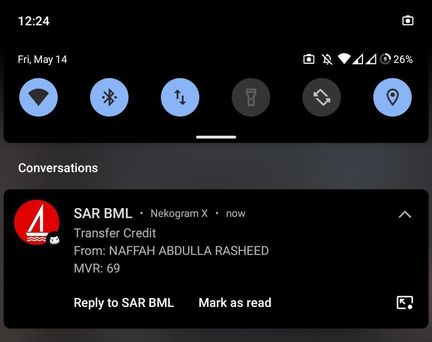

# BML-TG-NOTIFY
## Push Notification BML Transcations to Telegram


## Is it safe?
- Probably, I will NOT take resposibilty to whatever you do with this script,
Understand how this works before proceeding. Your BML Username and Password will be saved in PLAIN TEXT!
Anyone who has access (or gains access) to your server or computer can read .env file and obtain your BML login credentials!

## Limitations
- At the moment this script can only check 1 account from personal profile.
- Script ONLY sends notification for last transaction, so if there more than 1 transacation when script runs, 
you will get notification for the last one only.
### There's catch!
- BML do NOT allow you to be logged in more than 1 device at a time,
So when this script runs and if you were using Mobile App or Website you will be logged out!
Which is why I have added a delay to change how often script logs into account and check for new transactions,
This can be delay can be configured later. You either get fast notification but with less time to use app to do whatever you do
OR take as much as time you want to use app but slow notifications.

## Getting started. 
### Requriements
`curl` `jq`
- Install with whatever package manager you use.
- Make SURE they are installed before continuing!
### Download script and config
```
git clone https://github.com/shihaamabr/bml-tg-notify.git
cd bml-tg-notify
chmod +x bml-tg-notify.sh
cp env.sample .env
```
- Edit the contents of .env to your config (`nano .env`)\
- [How to obtain BML_ACCOUNTID](https://raw.githubusercontent.com/shihaamabr/bml-tg-notify/main/how-to-obtain-BML_ACCOUNTID.png)
### Execute the script
```
./bml-tg-notify.sh
```
- Maybe run in a screen to run in background?
## Setting Delay - Optional
- `echo XX > delay` where XX is the time in seconds you want to delay script runs,
By default this is set to 160. Please note that if the XX value is less than a certain value (I think 15)
your IP could get blocked by CloudFlare for DoS attack.
- You do not need to restart script after changing delay.
## Bugs
- [You tell me :)](https://github.com/shihaamabr/bml-tg-notify/issues/new)
